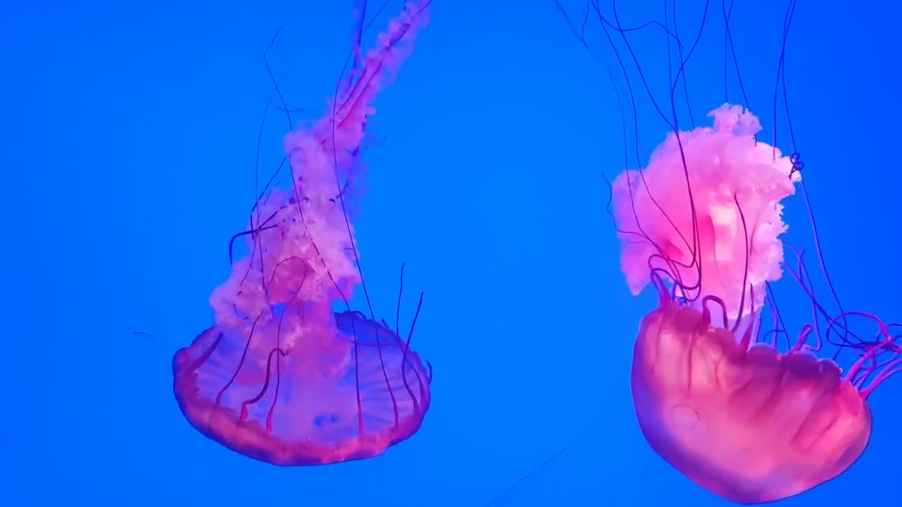
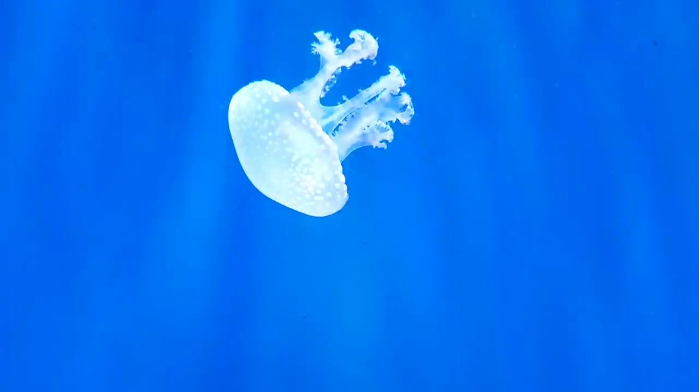
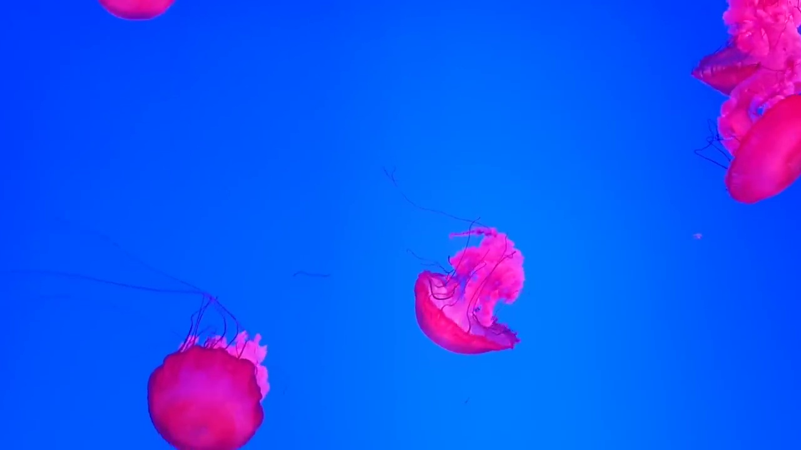
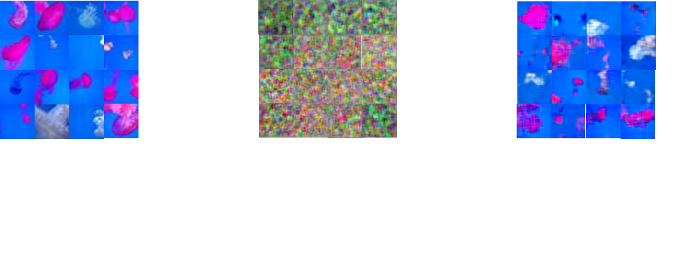

# DC-GAN Reimplementation

## Description

This project seeks to replicate the model from [Unsupervised Representation Learning with Deep Convolutional Generative Adversarial Networks](https://arxiv.org/abs/1511.06434) (2016) and validate its results on a novel dataset. Credit to the paper's [authors](https://github.com/Newmu/dcgan_code) for making their implementation simple and easy to follow and also to [eriklindernoren](https://github.com/eriklindernoren/PyTorch-GAN) for a clear PyTorch implementation.

Why undertake this project?
- I was keen to implement an academic paper that I enjoyed reading for myself.
- I was interested in creating my own toy dataset that I would try and create using a few simple steps and minimal data pre-processing.
- Additionally, it also interests me to see how machine learning models perform on more messy real-world datasets rather than only training them on well-established and heavily processed datasets.
- This project gives me an excuse to familiarise myself with a new machine learning framework (PyTorch) which I have little previous experience of.

## Dataset:

My quick and simple idea for creating a dataset was to sample the frames of a video of a specific scene/objects. If most of the video frames contain the objects of interest then a model can be expected to learn their representation. I discovered this video of [jellyfish](https://www.youtube.com/watch?v=SmfbP17xyqQ) and decided it would be interesting to see if a GAN could capture the unqiue shape of a Jellyfish.

## Pre-processing

- The video was sampled to produce ~ 10,000 datapoints.

    Examples of the screenshots sampled from the video:

      

- The images were cropped to squares and sub-sampled to 32x32 pixels.

- The mean and standard deviation for each image was normalised to improve performance.

    

- The dataset was augmented by applying rotation and reflections to each image to produce ~ 40,000 datapoints.

## Results

The DC-GAN was trained for 50 epochs on the jellyfish training data:

## Conclusions

- With some success a DC-GAN can synthesise images of jellyfish.
- The model is able to capture the overall shape of the jellyfish and its colours, although it struggles to capture fine features such as the tentacles.
- GANs clearly scale very well with more compute and data. It is a challenge to train them on small datasets such as this one and with access to limited compute.
- The DC-GAN struggles more on this dataset than other more carefully processed datasets. The images in this dataset often contain multiple jellyfish, sometimes the jellyfish are only half in the picture and they can be positioned at any angle. This is very different to training a GAN on a dataset such as the one comprised of human faces. Having all the faces carefully positioned in the centre of the image, and of the right orientation, ensures that the positions of features such as the eyes and nose are essentially fixed. This can significantly help with training.
- Hence it is important to acknowledge the amount of data pre-processing required for training deep generative models such as a DC-GAN. The necessary data pre-processing steps to achieve top performance take significant time to implement and often a lot of manual labour.
- This was an interesting project to undertake for a few hours :)