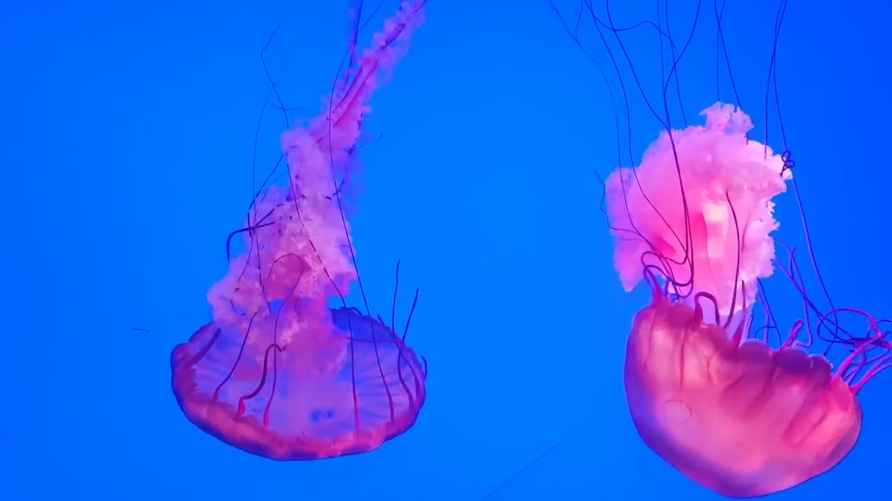
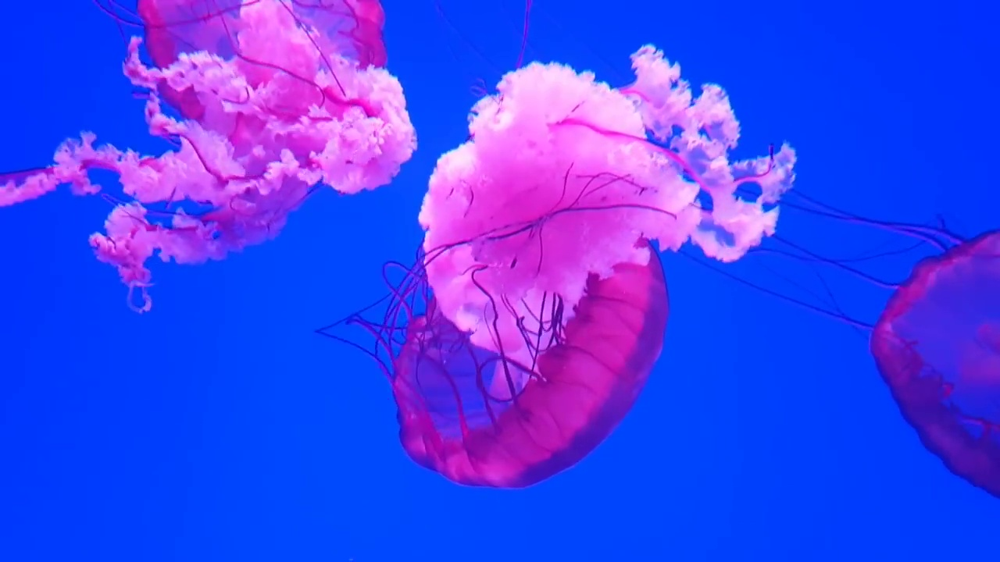
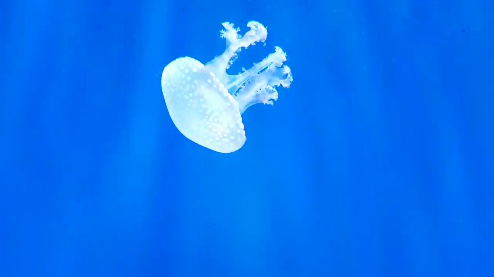
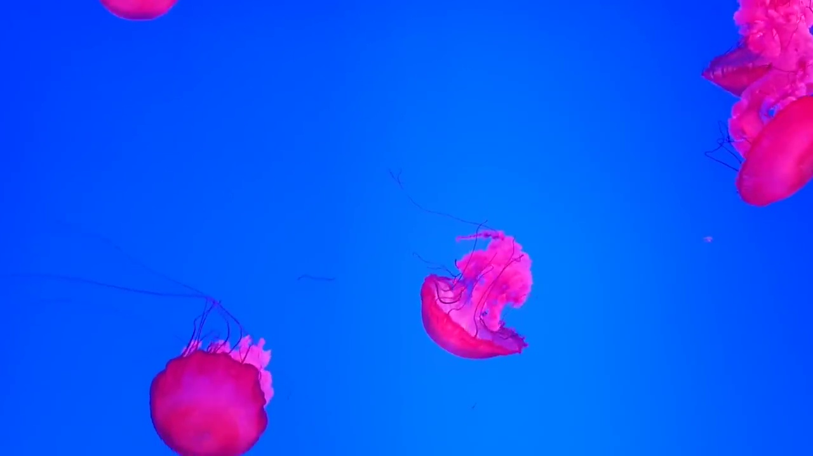
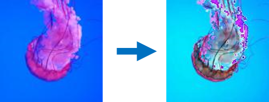
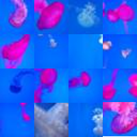
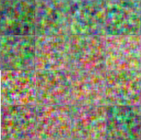
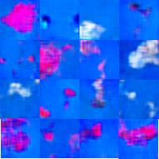

## Description

This project seeks to replicate the model from [Unsupervised Representation Learning with Deep Convolutional Generative Adversarial Networks](https://arxiv.org/abs/1511.06434) (2016) and validate its results.

There are several different reasons for my motivation to undertake this project:
- Firstly, I was keen to implement an academic paper that I enjoyed reading for myself.
- I wanted to create my own toy dataset using a few simple steps and minimal data pre-processing.
- Additionally, it interests me to see how machine learning models perform on more messy real-world datasets to see how much their performance drops.
- This project gives me an excuse to learn a new machine learning framework (PyTorch) which I have little previous experience of.

## Dataset:

My quick and simple idea for creating a dataset was to sample the frames of a video of a specific scene/objects. If most of the video frames contain the objects of interest then a model could be expected to learn its representation. I discovered this video of [Jellyfish](https://www.youtube.com/watch?v=SmfbP17xyqQ) and decided it would be interesting to see if a GAN could capture the unqiue shape of a Jellyfish.

## Pre-processing

- The video was sampled to produce ~ 10,000 datapoints.

Examples of the screenshots sampled from the video:

   

- The dataset was augmented by applying rotation and reflections to each image to produce ~ 40,000 datapoints.
- The images were cropped to squares and sub-sampled to 32x32 pixels.
- The mean and standard deviation for each image was normalised to improve training.

The normalisation of the mean and standard deviation for a single image:

## Results

  

(left: ground truth images, centre: images produced by the untrained generator, right: images synthesised after training)

## Conclusions

- With some success a DC-GAN can synthesise semi-realistic Jellyfish.
- The model struggles to capture fine features such as the tentacles but can better model the overall shape of the jellyfish.
- GANs clearly scale very well with more compute and data. It is a challenge to train them on small datasets such as this one with limited computational complexity (I trained on local machine with CPU).
- The GAN struggles more on this dataset than other more carefully processed datasets. There are often multiple Jellyfish in the images for this dataset and sometimes they are only half in the image. This is very different to training a GAN on a dataset such as human faces, where all the faces are carefully positioned to sit in the centre of the image so the positions of features such as the eyes and nose are essentially fixed.
- It is important to acknowledge the amount of data pre-processing required for training deep generative models such as a DC-GAN. The necessary data pre-processing steps to achieve top performance, such as ensuring only one large jellyfish is present in a single image, take significant time to implement and often a lot of manual labour.
- This was an interesting project to undertake for a few hours :)